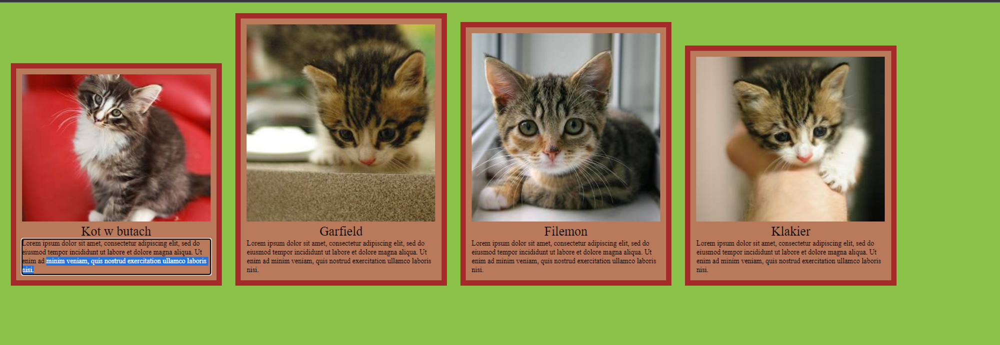


# Projekt Zero To Junior - Egzamin 1

## Deploy
https://github.com/GregorySVD/Zero2Junior

## Zadanie

1. odtwórz galerię kotów tak jak na screenie powyżej (nie musi być pixel-perfect)
do źródeł zdjęć użyj tych linków:
http://placekitten.com/320/250
http://placekitten.com/320/335
http://placekitten.com/320/320
http://placekitten.com/320/280
2. opis powinien być edytowalny, tak, żeby można było sprawdzać jak zachowuje się strona po dołożeniu tam treści lub 
   jej usunięciu
3. margines zewnętrzny i wewnętrzny oraz ramka powinny mieć rozmiar ustawiony z wykorzystaniem jednostki rem
4. zobacz co się stanie kiedy po skończonej pracy zaczniesz modyfikować font-size dla html oraz w body
5. rozwiązanie dla jednego wybranego font-size w html i body wrzuć w komentarzu
